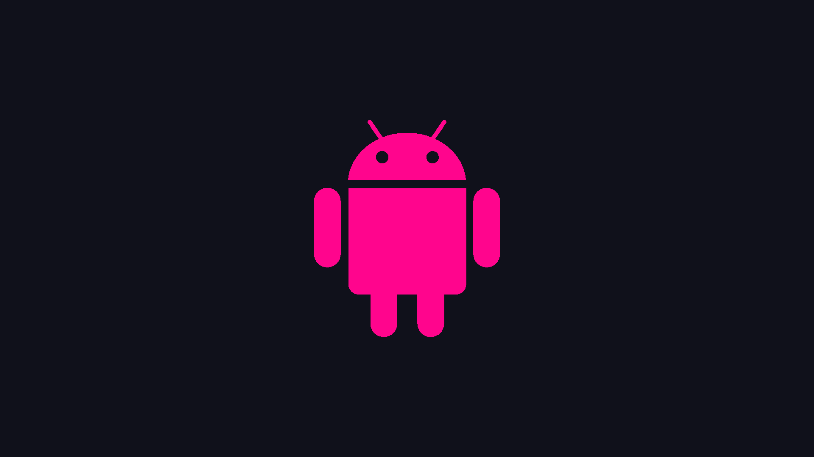

# Wallpapers
Blossom Theme inspired wallpapers

### Overview
This project focuses on creating beautiful wallpapers inspired by the Blossom Theme. The wallpapers are generated using a custom Python script, combining sleek black icons with carefully designed backgrounds to produce visually appealing 1080p desktop wallpapers.

### Creator

#### Python Script Details
- **Language**: Python
- **Main Libraries**: 
  - Pillow (PIL): For image processing and manipulation
  - OS: For file and directory operations
- **Functionality**:
  - Reads all black icons (512x512 pixels) from an input folder
  - Processes these icons to create 1080p wallpapers
  - Generates wallpapers in batches for efficiency

#### Wallpaper Directory
A dedicated directory for storing the generated wallpapers will be created soon. This will allow for easy access and organization of the created artwork.

### Technical Specifications
- **Input Icon Size**: 512x512 pixels
- **Output Wallpaper Resolution**: 1920x1080 pixels (1080p)
- **Icon Color**: Black (for consistent theme and easy manipulation)

### Process
1. The script scans the input folder for black icons
2. Each icon is then processed and incorporated into a new wallpaper design
3. The resulting wallpapers are saved in the designated output directory

### Future Plans
- Create Blossom Wallpaper directory

## Credits

### Icon Sources
The icons used in this project were carefully curated from reputable sources to ensure quality and consistency. The main source of icons is:

- [IconArchive](https://www.iconarchive.com)
  - A comprehensive resource for high-quality icons
  - Offers a wide variety of styles and themes
  - Ensures proper licensing for used icons

# Index

OS and Software

## Android

## BE OS

## Chrome

## Debian

## DOS

## Firefox

## Free BSD

## Haiku

## Internet Explorer

## Linux

## Mac OS

## Mandriva

## Netscape

## Opera

